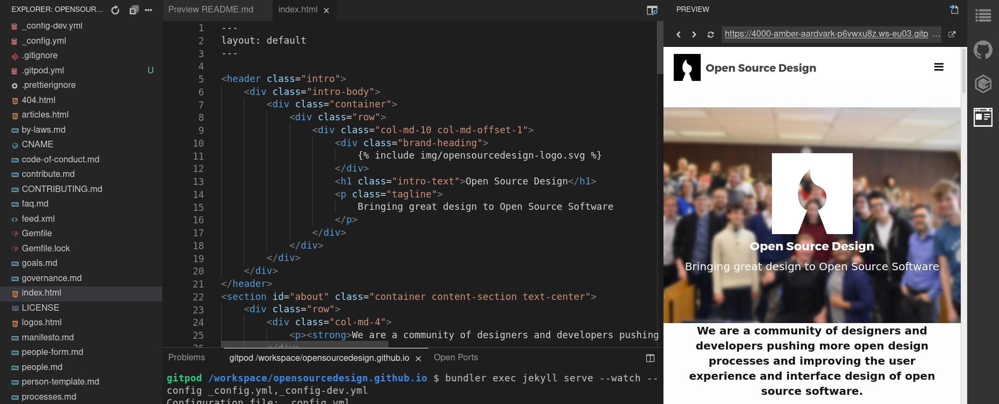

# [opensourcedesign.net](https://opensourcedesign.net)

Website of the Open Source Design community, hosted on GitHub Pages.

[](#backers) [](#sponsors) [](https://twitter.com/opensrcdesign)  [](https://gitpod.io/#https://github.com/opensourcedesign/opensourcedesign.github.io)

## Edit Website

Editing content on [opensourcedesign.net][osd-net] can be done in 3 ways, all of which require a GitHub account.

1. Using GitHub's nifty file editor, which is quick but limited:

    

2. [Using Gitpod](https://gitpod.io/#https://github.com/opensourcedesign/opensourcedesign.github.io) which gives you a preconfigured IDE and live preview. This is quick and you can see your changes:

    

3. Setting the website up locally, which is more technical.

## Code & Design The Website

To contribute to the website, you'll need some basic terminal skills and knowledge of web development technologies like HTML, CSS, and JavaScript. The site is built with the following tools:

- [Jekyll][jekyll]
- [Bootstrap][bootstrap]

### Installing

Before you begin, ensure you have a `Ruby` development environment and `Git` installed and configured to connect to GitHub with SSH.

#### Prerequisites

- **Ruby**: Jekyll requires Ruby version 2.5.0 or higher.
- **RubyGems**: Ruby package manager.
- **GCC and Make**: Essential for compiling native extensions.

You can install these dependencies using the following guides:

- [Installing Ruby][installing-ruby]
- [Using GitHub with SSH][github-ssh]

#### Installation Steps

1. **Install Bundler and Jekyll**

    First, install Bundler, which manages Ruby dependencies:

```sh
sudo gem install bundler
```

2. Fork and clone the main website repository

```sh
git clone --single-branch --branch master https://github.com/opensourcedesign/opensourcedesign.github.io.git
cd opensourcedesign.github.io/
bundle install
```

3. Clone the jobs repository

Currently the job board is still a separate repository, but [we plan to move it in here](https://github.com/opensourcedesign/opensourcedesign.github.io/issues/236).

```sh
git clone https://github.com/opensourcedesign/jobs.git
```

4. Build the static site & watch for files

```sh
bundler exec jekyll serve --watch --config _config.yml,_config-dev.yml
```


[osd-net]: https://opensourcedesign.net
[osd-org]: https://github.com/opensourcedesign/
[jekyll]: https://jekyllrb.com
[bootstrap]: https://getbootstrap.com
[installing-ruby]: https://www.ruby-lang.org/en/documentation/installation/
[github-ssh]: https://help.github.com/articles/connecting-to-github-with-ssh/


## 👩‍🚀 Contributors, backers & sponsors

This project exists thanks to all the **people who contribute**.
<a href="graphs/contributors"></a>

Thank you to **all our backers**! 🙏 ([Become a backer](https://opencollective.com/opensourcedesign#backer))

<a href="https://opencollective.com/opensourcedesign#backers" target="_blank"></a>

**Support this project by becoming a sponsor.** ([Become a sponsor](https://opencollective.com/opensourcedesign#sponsor))

<a href="https://opencollective.com/opensourcedesign/sponsor/0/website" target="_blank"></a>


## ♥ Code of Conduct

Please note that Open Source Design has a [Contributor Code of Conduct](https://opensourcedesign.net/code-of-conduct/). By participating in this project online or at events you agree to abide by its terms.


## 📜 License

**🔀 You can use & modify everything as long as you credit [Open Source Design](https://opensourcedesign.net) and use the same license for your resulting work.** [Code license is AGPLv3](https://www.gnu.org/licenses/agpl-3.0.en.html) and content is [Creative Commons Attribution-ShareAlike](https://creativecommons.org/licenses/by-sa/4.0/).
